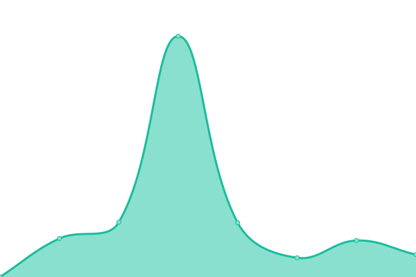

# [📈 Live Status](https://status.culturecloud.eu.org): <!--live status--> **🟧 Partial outage**

This repository contains the open-source uptime monitor and status page for [Culture Cloud](https://culturecloud.eu.org), powered by [Upptime](https://github.com/upptime/upptime).

With [Upptime](https://upptime.js.org), you can get your own unlimited and free uptime monitor and status page, powered entirely by a GitHub repository. We use [Issues](https://github.com/culturecloud/status/issues) as incident reports, [Actions](https://github.com/culturecloud/status/actions) as uptime monitors, and [Pages](https://status.culturecloud.eu.org) for the status page.

<!--start: status pages-->
<!-- This summary is generated by Upptime (https://github.com/upptime/upptime) -->
<!-- Do not edit this manually, your changes will be overwritten -->
<!-- prettier-ignore -->
| URL | Status | History | Response Time | Uptime |
| --- | ------ | ------- | ------------- | ------ |
|  [Culture Cloud Blog](https://culturecloud.eu.org) | 🟩 Up | [culture-cloud-blog.yml](https://github.com/culturecloud/status/commits/HEAD/history/culture-cloud-blog.yml) | 

 240ms
     
 | 

<a href="https://status.culturecloud.eu.org/history/culture-cloud-blog">100.00%</a>
    

|  [DDL Service](https://dl.culturecloud.eu.org) | 🟩 Up | [ddl-service.yml](https://github.com/culturecloud/status/commits/HEAD/history/ddl-service.yml) | 

 811ms
     
 | 

<a href="https://status.culturecloud.eu.org/history/ddl-service">87.02%</a>
    

|  [OneDrive Index](https://onedrive.culturecloud.eu.org) | 🟩 Up | [one-drive-index.yml](https://github.com/culturecloud/status/commits/HEAD/history/one-drive-index.yml) | 

 837ms
     
 | 

<a href="https://status.culturecloud.eu.org/history/one-drive-index">100.00%</a>
    

|  [GDrive Index](https://gdrive.culturecloud.eu.org) | 🟩 Up | [g-drive-index.yml](https://github.com/culturecloud/status/commits/HEAD/history/g-drive-index.yml) | 

 383ms
     
 | 

<a href="https://status.culturecloud.eu.org/history/g-drive-index">100.00%</a>
    

|  [Status Page](https://status.culturecloud.eu.org) | 🟩 Up | [status-page.yml](https://github.com/culturecloud/status/commits/HEAD/history/status-page.yml) | 

 224ms
     
 | 

<a href="https://status.culturecloud.eu.org/history/status-page">100.00%</a>
    

|  [Image Proxy Service](https://images.culturecloud.eu.org) | 🟩 Up | [image-proxy-service.yml](https://github.com/culturecloud/status/commits/HEAD/history/image-proxy-service.yml) | 

 591ms
     
 | 

<a href="https://status.culturecloud.eu.org/history/image-proxy-service">100.00%</a>
    

|  [Web Monitor](https://monitor.culturecloud.eu.org) | 🟩 Up | [web-monitor.yml](https://github.com/culturecloud/status/commits/HEAD/history/web-monitor.yml) | 

 443ms
     
 | 

<a href="https://status.culturecloud.eu.org/history/web-monitor">99.64%</a>
    

|  [Shiori](https://shiori.culturecloud.eu.org) | 🟥 Down | [shiori.yml](https://github.com/culturecloud/status/commits/HEAD/history/shiori.yml) | 

 950ms
     
 | 

<a href="https://status.culturecloud.eu.org/history/shiori">99.54%</a>
    

|  [VFS Monitor](https://vfs.autodox.repl.co) | 🟩 Up | [vfs-monitor.yml](https://github.com/culturecloud/status/commits/HEAD/history/vfs-monitor.yml) | 

 424ms
     
 | 

<a href="https://status.culturecloud.eu.org/history/vfs-monitor">99.54%</a>
    

<!--end: status pages-->

[**Visit our status website →**](https://status.culturecloud.eu.org)

## 📄 License

- Powered by: [Upptime](https://github.com/upptime/upptime)
- Code: [MIT](./LICENSE) © [Culture Cloud](https://culturecloud.eu.org)
- Data in the `./history` directory: [Open Database License](https://opendatacommons.org/licenses/odbl/1-0/)
