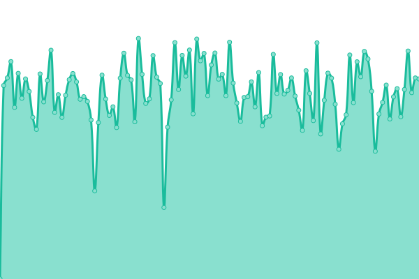

# [📈 Live Status](https://status.culturecloud.gq): <!--live status--> **🟨 Degraded performance**

This repository contains the open-source uptime monitor and status page for [Culture Cloud](https://culturecloud.gq), powered by [Upptime](https://github.com/upptime/upptime).

With [Upptime](https://upptime.js.org), you can get your own unlimited and free uptime monitor and status page, powered entirely by a GitHub repository. We use [Issues](https://github.com/culturecloud/status/issues) as incident reports, [Actions](https://github.com/culturecloud/status/actions) as uptime monitors, and [Pages](https://status.culturecloud.gq) for the status page.

<!--start: status pages-->
<!-- This summary is generated by Upptime (https://github.com/upptime/upptime) -->
<!-- Do not edit this manually, your changes will be overwritten -->
<!-- prettier-ignore -->
| URL | Status | History | Response Time | Uptime |
| --- | ------ | ------- | ------------- | ------ |
|  [Culture Cloud Blog](https://culturecloud.gq) | 🟩 Up | [culture-cloud-blog.yml](https://github.com/culturecloud/status/commits/HEAD/history/culture-cloud-blog.yml) | 

 444ms
     
 | 

<a href="https://status.culturecloud.gq/history/culture-cloud-blog">100.00%</a>
    

|  [Personal Journal](https://journal.culturecloud.gq) | 🟩 Up | [personal-journal.yml](https://github.com/culturecloud/status/commits/HEAD/history/personal-journal.yml) | 

 1534ms
     
 | 

<a href="https://status.culturecloud.gq/history/personal-journal">100.00%</a>
    

|  [DDL Service](https://dl.culturecloud.gq) | 🟩 Up | [ddl-service.yml](https://github.com/culturecloud/status/commits/HEAD/history/ddl-service.yml) | 

 553ms
     
 | 

<a href="https://status.culturecloud.gq/history/ddl-service">100.00%</a>
    

|  [Telegram Index](https://tgdex.culturecloud.gq) | 🟨 Degraded | [telegram-index.yml](https://github.com/culturecloud/status/commits/HEAD/history/telegram-index.yml) | 

 2781ms
     
 | 

<a href="https://status.culturecloud.gq/history/telegram-index">0.00%</a>
    

<!--end: status pages-->

[**Visit our status website →**](https://status.culturecloud.gq)

## 📄 License

- Powered by: [Upptime](https://github.com/upptime/upptime)
- Code: [MIT](./LICENSE) © [Culture Cloud](https://culturecloud.gq)
- Data in the `./history` directory: [Open Database License](https://opendatacommons.org/licenses/odbl/1-0/)
