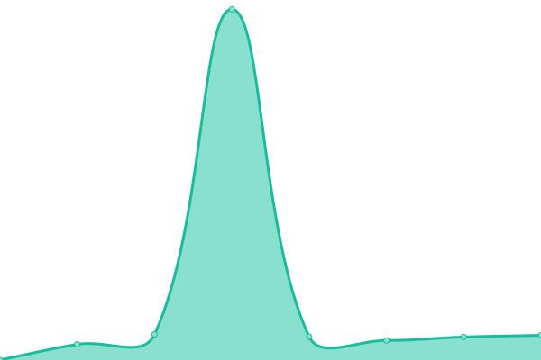
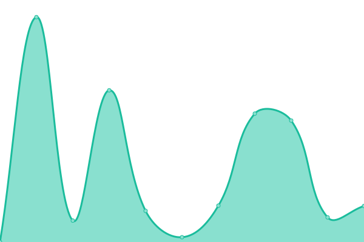
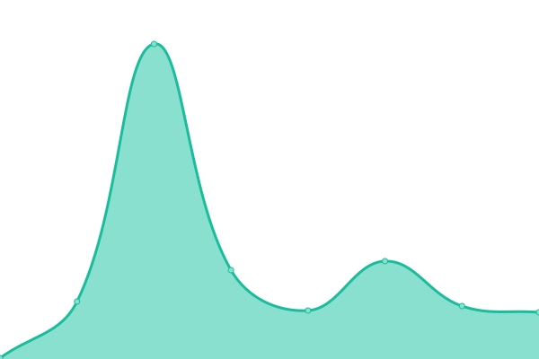

# [📈 Live Status](https://status.culturecloud.eu.org): <!--live status--> **🟧 Partial outage**

This repository contains the open-source uptime monitor and status page for [Culture Cloud](https://culturecloud.eu.org), powered by [Upptime](https://github.com/upptime/upptime).

With [Upptime](https://upptime.js.org), you can get your own unlimited and free uptime monitor and status page, powered entirely by a GitHub repository. We use [Issues](https://github.com/culturecloud/status/issues) as incident reports, [Actions](https://github.com/culturecloud/status/actions) as uptime monitors, and [Pages](https://status.culturecloud.eu.org) for the status page.

<!--start: status pages-->
<!-- This summary is generated by Upptime (https://github.com/upptime/upptime) -->
<!-- Do not edit this manually, your changes will be overwritten -->
<!-- prettier-ignore -->
| URL | Status | History | Response Time | Uptime |
| --- | ------ | ------- | ------------- | ------ |
|  [Official Blog](https://culturecloud.eu.org) | 🟩 Up | [official-blog.yml](https://github.com/culturecloud/status/commits/HEAD/history/official-blog.yml) | 

 405ms
     
 | 

<a href="https://status.culturecloud.eu.org/history/official-blog">100.00%</a>
    

|  [Official Status Page](https://status.culturecloud.eu.org) | 🟩 Up | [official-status-page.yml](https://github.com/culturecloud/status/commits/HEAD/history/official-status-page.yml) | 

 417ms
     
 | 

<a href="https://status.culturecloud.eu.org/history/official-status-page">100.00%</a>
    

|  Telegram DDL Service | 🟥 Down | [telegram-ddl-service.yml](https://github.com/culturecloud/status/commits/HEAD/history/telegram-ddl-service.yml) | 

 260ms
     
 | 

<a href="https://status.culturecloud.eu.org/history/telegram-ddl-service">0.00%</a>
    

|  [OneDrive DDL Service (Nihon)](https://nihon.culturecloud.eu.org) | 🟩 Up | [one-drive-ddl-service-nihon.yml](https://github.com/culturecloud/status/commits/HEAD/history/one-drive-ddl-service-nihon.yml) | 

 447ms
     
 | 

<a href="https://status.culturecloud.eu.org/history/one-drive-ddl-service-nihon">100.00%</a>
    

|  [OneDrive DDL Service (Usonia)](https://usonia.culturecloud.eu.org) | 🟩 Up | [one-drive-ddl-service-usonia.yml](https://github.com/culturecloud/status/commits/HEAD/history/one-drive-ddl-service-usonia.yml) | 

 358ms
     
 | 

<a href="https://status.culturecloud.eu.org/history/one-drive-ddl-service-usonia">100.00%</a>
    

|  [GDrive DDL Service](https://gdi.culturecloud.eu.org) | 🟩 Up | [g-drive-ddl-service.yml](https://github.com/culturecloud/status/commits/HEAD/history/g-drive-ddl-service.yml) | 

 10176ms
     
 | 

<a href="https://status.culturecloud.eu.org/history/g-drive-ddl-service">100.00%</a>
    

|  [Multi Cloud (Rclone) DDL Service](https://rci.culturecloud.eu.org) | 🟥 Down | [multi-cloud-rclone-ddl-service.yml](https://github.com/culturecloud/status/commits/HEAD/history/multi-cloud-rclone-ddl-service.yml) | 

 929ms
     
 | 

<a href="https://status.culturecloud.eu.org/history/multi-cloud-rclone-ddl-service">0.00%</a>
    

|  [Image Proxy Service](https://images.culturecloud.eu.org) | 🟩 Up | [image-proxy-service.yml](https://github.com/culturecloud/status/commits/HEAD/history/image-proxy-service.yml) | 

 659ms
     
 | 

<a href="https://status.culturecloud.eu.org/history/image-proxy-service">100.00%</a>
    

|  [Pixiv Frontend](https://pixiv.culturecloud.eu.org) | 🟥 Down | [pixiv-frontend.yml](https://github.com/culturecloud/status/commits/HEAD/history/pixiv-frontend.yml) | 

 0ms
     
 | 

<a href="https://status.culturecloud.eu.org/history/pixiv-frontend">0.00%</a>
    

|  [Web Monitoring Service ⚡](https://monitor.culturecloud.eu.org/api/v1/systeminfo) | 🟥 Down | [web-monitoring-service.yml](https://github.com/culturecloud/status/commits/HEAD/history/web-monitoring-service.yml) | 

 215ms
     
 | 

<a href="https://status.culturecloud.eu.org/history/web-monitoring-service">0.00%</a>
    

|  [qBittorrent ⚡](https://qbt.culturecloud.eu.org) | 🟥 Down | [q-bittorrent.yml](https://github.com/culturecloud/status/commits/HEAD/history/q-bittorrent.yml) | 

 0ms
     
 | 

<a href="https://status.culturecloud.eu.org/history/q-bittorrent">0.00%</a>
    

|  [Jackett ⚡](https://jackett.culturecloud.eu.org) | 🟥 Down | [jackett.yml](https://github.com/culturecloud/status/commits/HEAD/history/jackett.yml) | 

 82ms
     
 | 

<a href="https://status.culturecloud.eu.org/history/jackett">0.00%</a>
    

|  [Duplicati ⚡](https://duplicati.culturecloud.eu.org) | 🟥 Down | [duplicati.yml](https://github.com/culturecloud/status/commits/HEAD/history/duplicati.yml) | 

 139ms
     
 | 

<a href="https://status.culturecloud.eu.org/history/duplicati">0.00%</a>
    

|  Filebrowser ⚡ (iafuad) | 🟥 Down | [filebrowser-iafuad.yml](https://github.com/culturecloud/status/commits/HEAD/history/filebrowser-iafuad.yml) | 

 330ms
     
 | 

<a href="https://status.culturecloud.eu.org/history/filebrowser-iafuad">0.00%</a>
    

|  Filebrowser ⚡ (pseudo-kawaii) | 🟥 Down | [filebrowser-pseudo-kawaii.yml](https://github.com/culturecloud/status/commits/HEAD/history/filebrowser-pseudo-kawaii.yml) | 

 237ms
     
 | 

<a href="https://status.culturecloud.eu.org/history/filebrowser-pseudo-kawaii">0.00%</a>
    

<!--end: status pages-->

[**Visit our status website →**](https://status.culturecloud.eu.org)

## 📄 License

- Powered by: [Upptime](https://github.com/upptime/upptime)
- Code: [MIT](./LICENSE) © [Culture Cloud](https://culturecloud.eu.org)
- Data in the `./history` directory: [Open Database License](https://opendatacommons.org/licenses/odbl/1-0/)
