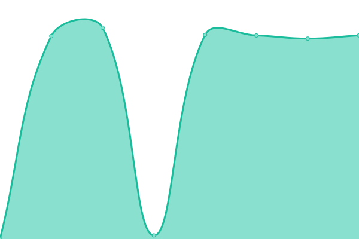

# [📈 Live Status](https://status.culturecloud.eu.org): <!--live status--> **🟧 Partial outage**

This repository contains the open-source uptime monitor and status page for [Culture Cloud](https://culturecloud.eu.org), powered by [Upptime](https://github.com/upptime/upptime).

With [Upptime](https://upptime.js.org), you can get your own unlimited and free uptime monitor and status page, powered entirely by a GitHub repository. We use [Issues](https://github.com/culturecloud/status/issues) as incident reports, [Actions](https://github.com/culturecloud/status/actions) as uptime monitors, and [Pages](https://status.culturecloud.eu.org) for the status page.

<!--start: status pages-->
<!-- This summary is generated by Upptime (https://github.com/upptime/upptime) -->
<!-- Do not edit this manually, your changes will be overwritten -->
<!-- prettier-ignore -->
| URL | Status | History | Response Time | Uptime |
| --- | ------ | ------- | ------------- | ------ |
|  [Official Blog](https://culturecloud.eu.org) | 🟩 Up | [official-blog.yml](https://github.com/culturecloud/status/commits/HEAD/history/official-blog.yml) | 

 381ms
     
 | 

<a href="https://status.culturecloud.eu.org/history/official-blog">100.00%</a>
    

|  [Official Status Page](https://status.culturecloud.eu.org) | 🟩 Up | [official-status-page.yml](https://github.com/culturecloud/status/commits/HEAD/history/official-status-page.yml) | 

 291ms
     
 | 

<a href="https://status.culturecloud.eu.org/history/official-status-page">100.00%</a>
    

|  Telegram DDL Service | 🟩 Up | [telegram-ddl-service.yml](https://github.com/culturecloud/status/commits/HEAD/history/telegram-ddl-service.yml) | 

 895ms
     
 | 

<a href="https://status.culturecloud.eu.org/history/telegram-ddl-service">25.31%</a>
    

|  OneDrive DDL Service | 🟩 Up | [one-drive-ddl-service.yml](https://github.com/culturecloud/status/commits/HEAD/history/one-drive-ddl-service.yml) | 

 1384ms
     
 | 

<a href="https://status.culturecloud.eu.org/history/one-drive-ddl-service">100.00%</a>
    

|  OneDrive DDL Service 2 | 🟩 Up | [one-drive-ddl-service-2.yml](https://github.com/culturecloud/status/commits/HEAD/history/one-drive-ddl-service-2.yml) | 

 1775ms
     
 | 

<a href="https://status.culturecloud.eu.org/history/one-drive-ddl-service-2">100.00%</a>
    

|  GDrive DDL Service | 🟩 Up | [g-drive-ddl-service.yml](https://github.com/culturecloud/status/commits/HEAD/history/g-drive-ddl-service.yml) | 

 452ms
     
 | 

<a href="https://status.culturecloud.eu.org/history/g-drive-ddl-service">100.00%</a>
    

|  Rclone DDL Service | 🟩 Up | [rclone-ddl-service.yml](https://github.com/culturecloud/status/commits/HEAD/history/rclone-ddl-service.yml) | 

 395ms
     
 | 

<a href="https://status.culturecloud.eu.org/history/rclone-ddl-service">100.00%</a>
    

|  Image Proxy Service | 🟩 Up | [image-proxy-service.yml](https://github.com/culturecloud/status/commits/HEAD/history/image-proxy-service.yml) | 

 490ms
     
 | 

<a href="https://status.culturecloud.eu.org/history/image-proxy-service">100.00%</a>
    

|  Web Monitoring Service | 🟥 Down | [web-monitoring-service.yml](https://github.com/culturecloud/status/commits/HEAD/history/web-monitoring-service.yml) | 

 284ms
     
 | 

<a href="https://status.culturecloud.eu.org/history/web-monitoring-service">24.82%</a>
    

|  Freenom Renewal Service | 🟩 Up | [freenom-renewal-service.yml](https://github.com/culturecloud/status/commits/HEAD/history/freenom-renewal-service.yml) | 

 432ms
     
 | 

<a href="https://status.culturecloud.eu.org/history/freenom-renewal-service">100.00%</a>
    

|  Rendered Bless Service V1 | 🟩 Up | [rendered-bless-service-v1.yml](https://github.com/culturecloud/status/commits/HEAD/history/rendered-bless-service-v1.yml) | 

 413ms
     
 | 

<a href="https://status.culturecloud.eu.org/history/rendered-bless-service-v1">100.00%</a>
    

|  Rendered Bless Service V2 (Chrome) | 🟩 Up | [rendered-bless-service-v2-chrome.yml](https://github.com/culturecloud/status/commits/HEAD/history/rendered-bless-service-v2-chrome.yml) | 

 413ms
     
 | 

<a href="https://status.culturecloud.eu.org/history/rendered-bless-service-v2-chrome">100.00%</a>
    

<!--end: status pages-->

[**Visit our status website →**](https://status.culturecloud.eu.org)

## 📄 License

- Powered by: [Upptime](https://github.com/upptime/upptime)
- Code: [MIT](./LICENSE) © [Culture Cloud](https://culturecloud.eu.org)
- Data in the `./history` directory: [Open Database License](https://opendatacommons.org/licenses/odbl/1-0/)
